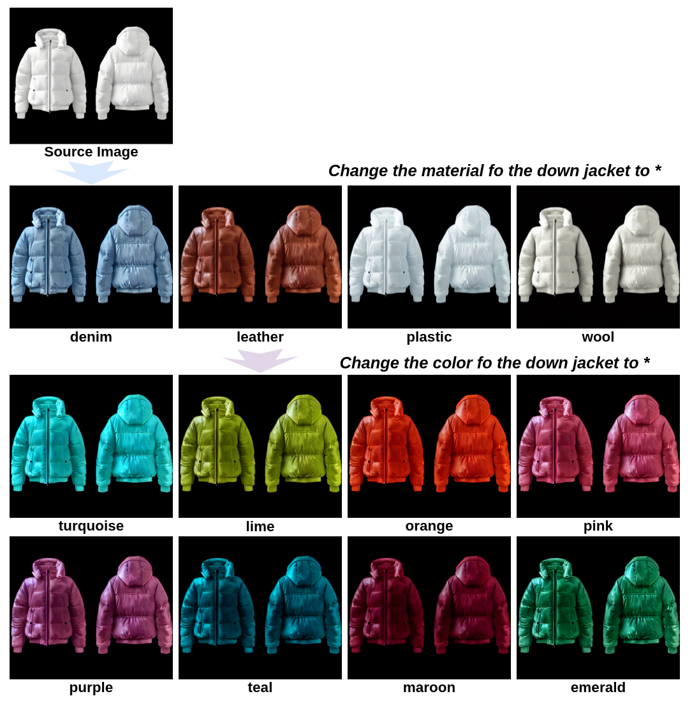
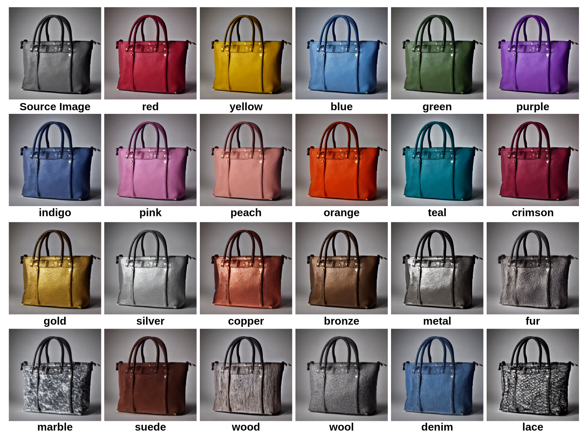

# InstructAttribute: Fine-grained Object Attributes editing with Instruction

[](https://arxiv.org/abs/2505.00751)



This is the official model implementation repository of 
**instructAttribute: Fine-grained Object Attributes editing with Instruction**

### **🚀** **Quick Start**

**Clone instruct-pix2pix repo**

```
git clone https://github.com/timothybrooks/instruct-pix2pix.git
cd instruct-pix2pix
pip install -r requirements.txt
```

**Download InstructAttribute Model**

Download the **[InstructAttribute](https://huggingface.co/yinxingxi/instructAttribute) model**  

### Inference

```
CUDA_VISIBLE_DEVICES=1 python3 edit_cli.py --input ./images/coat.png --output output.png --edit "change the material of the coat to leather" --ckpt /path_to_model
```


### SPAA: Structure-Preserving and Attribute Amplification



**Environment setup**

```
pip install -r requirements.txt
```

**Download SD 1.4**

Download the **[SD1.4](https://huggingface.co/CompVis/stable-diffusion-v1-4)**

**Attribute Data Generation**

```bash
CUDA_VISIBLE_DEVICES=1 python3 inference_spaa.py --model /path_to_SD1.4 --prompt "a photo of" --subject "handbag" --attribute "red"
```

💖 Our model is based on the awesome **[SD 1.4 ](https://huggingface.co/CompVis/stable-diffusion-v1-4) ,[instruct-pix2pix](https://github.com/timothybrooks/instruct-pix2pix), and [prompt-to-prompt](https://github.com/google/prompt-to-prompt) **

## 📚 Citation

```shell
@article{yin2025instructattribute,
  title={InstructAttribute: Fine-grained Object Attributes editing with Instruction},
  author={Yin, Xingxi and Zhang, Jingfeng and Deng, Yue and Li, Zhi and Li, Yicheng and Zhang, Yin},
  journal={arXiv preprint arXiv:2505.00751},
  year={2025}
}
```

